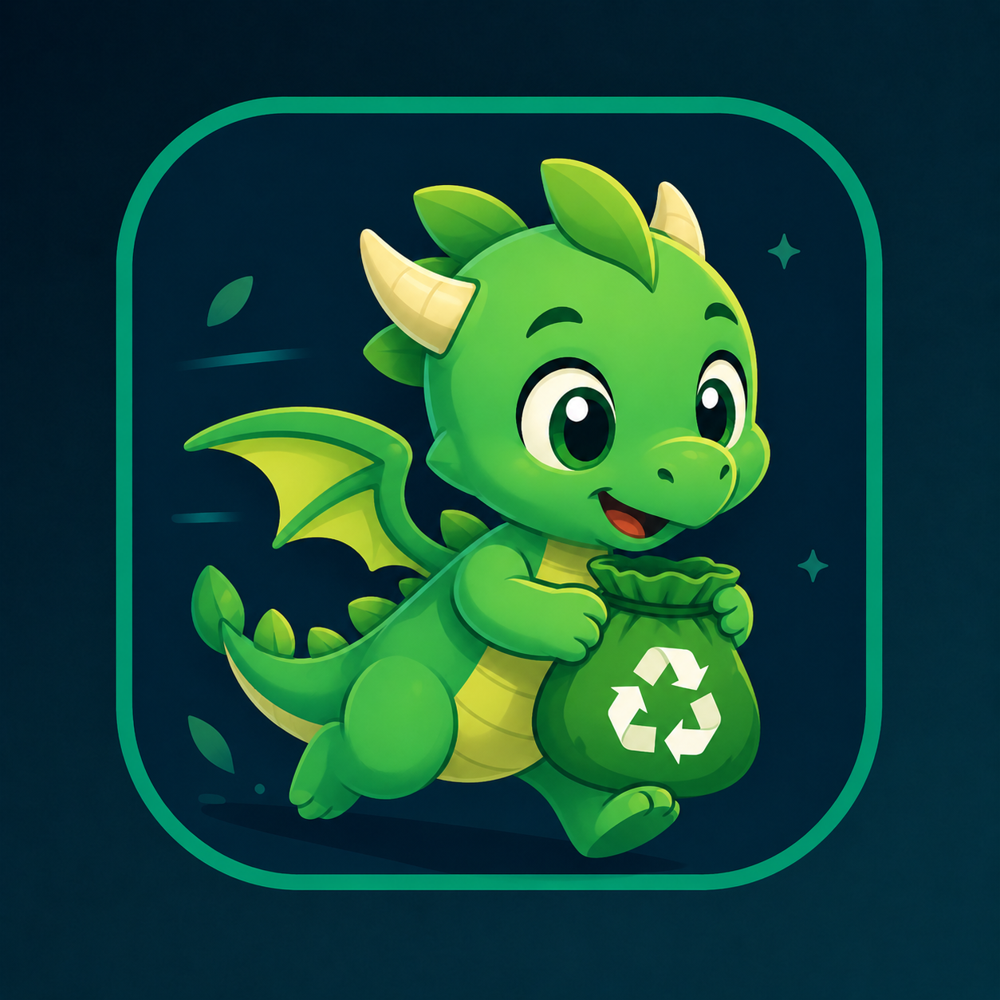

# TrashDash
<p align="center">
  
</p>


TrashDash e' un'applicazione mobile in forma di educational game dedicata alla raccolta differenziata. Il progetto trasforma lo smistamento dei rifiuti in un'esperienza interattiva: l'utente riconosce gli oggetti, li trascina nel contenitore corretto, accumula punteggio, riceve feedback sugli errori e puo' confrontarsi con altri giocatori.

Questo repository mantiene un solo README principale per presentare l'intero progetto. La documentazione completa, i materiali di consegna e gli approfondimenti tecnici sono disponibili nel Drive ufficiale del gruppo.

## Documentazione ufficiale

[Cartella Google Drive del progetto](https://drive.google.com/drive/folders/1M_5jjC_RomTToiA7NyK14MkHqKCE5Gag?usp=drive_link)

Nel Drive sono raccolti i documenti utili per descrivere l'applicazione, l'architettura, il design, il frontend, il backend, il database e la presentazione del lavoro.

## Obiettivo del progetto

TrashDash nasce con l'obiettivo di rendere piu' semplice e coinvolgente l'apprendimento della raccolta differenziata. L'app usa meccaniche da gioco arcade per aiutare l'utente a memorizzare il contenitore corretto per ogni rifiuto e, quando possibile, ad applicare regole coerenti con il territorio rilevato.

## Funzionalita' principali

- Registrazione, login e accesso ospite.
- Profilo utente con punteggio, monete, impostazioni e oggetti cosmetici.
- Gameplay drag-and-drop con timer, vite e difficolta' progressive.
- Feedback immediato sugli errori e report didattico a fine partita.
- Catalogo dei rifiuti e regole di smistamento.
- Regole locali basate su localizzazione.
- Classifica globale degli utenti.
- Shop cosmetico con acquisto ed equipaggiamento degli item.
- Modalita' scontro 1v1 tramite codice lobby.

## Struttura del progetto

Nella versione applicativa completa, TrashDash e' diviso in frontend mobile, backend, documentazione e demo di supporto:

```text
TrashDash/
|-- Trash_Dash_backend/     # API REST + WebSocket, Prisma, PostgreSQL, Docker per il database
|-- Trash_Dash_frontend/    # app mobile Expo / React Native
|-- TrashDash_Manuale/      # demo web di supporto per test localizzazione/catalogo
|-- .gitignore              # esclusioni per env, dipendenze, build e cache
`-- README.md               # presentazione generale del progetto
```

## Architettura Onion

Il backend segue una struttura ispirata alla Onion/Clean Architecture. L'idea principale e' tenere al centro il dominio dell'applicazione, cioe' le regole importanti del progetto, e spostare verso l'esterno i dettagli tecnici come Express, Prisma, JWT, bcrypt e provider esterni.

```text
Trash_Dash_backend/
|-- prisma/                 # schema Prisma e seed iniziale del database
|-- src/
|   |-- domain/             # centro: tipi, entita', value object, errori e contratti repository
|   |-- application/        # use case: auth, utenti, partite, catalogo, shop, lobby, leaderboard
|   |-- infrastructure/     # implementazioni tecniche: Prisma, bcrypt, JWT, geolocation provider
|   |-- presentation/       # route HTTP Express, middleware, validazione input e gestione errori
|   |-- main/               # composizione dipendenze e container applicativo
|   |-- websocket/          # canale realtime per lobby/scontro
|   |-- app.ts              # configurazione Express e route principali
|   `-- index.ts            # avvio server HTTP e WebSocket
|-- docker-compose.yml      # container PostgreSQL locale
`-- package.json            # script backend e dipendenze Node.js
```

Lettura a strati:

- **domain** e' il nucleo: definisce cosa esiste nel progetto, ad esempio utenti, punteggi, lobby, item shop, regole di gioco e repository come contratti.
- **application** contiene i casi d'uso: registrare un utente, fare login, salvare una partita, calcolare premi, comprare/equipaggiare item, creare o chiudere lobby.
- **infrastructure** collega il codice al mondo esterno: database con Prisma, hashing password con bcrypt, token JWT, provider di geolocalizzazione.
- **presentation** espone l'applicazione: route REST, middleware di autenticazione, validazione degli input e risposte HTTP.
- **main** collega tutto: istanzia repository, servizi, use case e dipendenze.

Il frontend usa una separazione simile, piu' leggera, per non mescolare regole di gioco, chiamate API e interfaccia:

```text
Trash_Dash_frontend/
|-- assets/                 # immagini, icona, audio e SVG
|-- src/
|   |-- domain/             # regole di gioco, catalogo rifiuti e regole locali
|   |-- application/        # funzioni riusabili per auth e sessione di gioco
|   |-- infrastructure/     # adapter API backend e storage locale
|   `-- presentation/       # componenti, hook, traduzioni e stili
|-- App.js                  # composizione principale dell'app Expo
|-- app.json                # configurazione Expo
`-- package.json            # script frontend e dipendenze Expo
```

Questa organizzazione rende piu' facile spiegare il progetto: il backend contiene la logica stabile, il frontend gestisce l'esperienza utente, mentre database e servizi esterni restano dettagli tecnici sostituibili.

## Tecnologie utilizzate

- **React Native / Expo** per l'app mobile.
- **JavaScript** per la parte frontend.
- **Node.js** per l'ambiente backend.
- **Express** per l'esposizione delle API.
- **TypeScript** per rendere il backend piu' tipizzato e manutenibile.
- **PostgreSQL** come database relazionale.
- **Prisma** come ORM e livello di accesso al database.
- **Docker** per avviare PostgreSQL in modo riproducibile.
- **API REST** per la comunicazione tra app e backend.
- **WebSocket** come canale realtime disponibile per la modalita' scontro.
- **Onion/Clean Architecture** per separare dominio, casi d'uso, infrastruttura e presentazione.

## Avvio rapido in locale

Metodo consigliato: usare lo script cross-platform alla radice del progetto. Lo script funziona su Windows, macOS e Linux perche usa Node.js, rileva automaticamente l'IP LAN, scrive i file `.env`, avvia PostgreSQL con Docker, prepara Prisma, avvia backend e apre Expo.

### Prerequisiti

- Node.js `>=20 <25`.
- npm incluso con Node.js.
- Docker Desktop installato e avviato.
- Expo Go su smartphone, oppure emulatore Android/iOS.
- PC e telefono sulla stessa rete Wi-Fi se si usa un dispositivo fisico.
- Firewall aperto sulle porte `4000` e `8081`.

Verifica rapida:

```powershell
node -v
npm -v
docker --version
docker compose version
```

### Primo avvio completo

Dalla radice della repo:

```powershell
cd TrashDash
npm run start:setup
```

Il comando esegue:

- installazione dipendenze backend/frontend se necessario;
- creazione degli `.env` locali;
- avvio PostgreSQL Docker;
- `prisma generate`, `prisma db push` e seed;
- backend su `http://localhost:4000/api`;
- frontend Expo in modalita' LAN.

### Avvii successivi

```powershell
cd TrashDash
npm start
```

Se il QR LAN non funziona con Expo Go, usare il tunnel:

```powershell
npm run start:tunnel
```

Se lo script sceglie l'IP sbagliato, forzare manualmente l'IP LAN del PC:

```powershell
npm start -- --ip=192.168.1.25
```

Comandi utili dello script:

```powershell
npm run start:web          # avvio frontend web
npm run start:android      # Android Emulator, API su 10.0.2.2
npm run start:frontend     # solo frontend
npm run start:backend      # solo backend/database
node scripts/start-trashdash.js --help
```

### Avvio manuale backend

Se si preferisce avviare tutto a mano, aprire due terminali separati. Nel primo terminale:

```powershell
cd Trash_Dash_backend
Copy-Item .env.example .env
npm ci
docker compose up -d
npm run prisma:generate
npm run prisma:push
npm run seed
npm run dev
```

Su macOS/Linux il comando per copiare l'env e':

```bash
cp .env.example .env
```

Il backend avvia:

- PostgreSQL Docker su `localhost:5434`;
- API Express su `http://localhost:4000/api`;
- WebSocket su `ws://localhost:4000/ws`.

Controllo stato database:

```powershell
docker compose ps
```

Controllo API:

```powershell
curl http://localhost:4000/api/health
```

La risposta deve contenere:

```json
{
  "status": "ok",
  "service": "trashdash-backend"
}
```

Durante il seed vengono creati catalogo rifiuti, regole locali, item cosmetici e account admin demo.

Account demo:

```text
email: admin@admin.admin
password: admin123
```

### Avvio manuale frontend

Nel secondo terminale:

```powershell
cd Trash_Dash_frontend
npm ci
npx expo install --check
npx expo start --lan --clear
```

Dal pannello Expo e' possibile aprire l'app su web, emulatore o dispositivo fisico.

Per sviluppo locale con variabile esplicita:

```powershell
$env:EXPO_PUBLIC_API_BASE_URL="http://localhost:4000/api"
$env:EXPO_PUBLIC_WS_URL="ws://localhost:4000/ws"
npx expo start --lan --clear
```

Comandi diretti:

```powershell
$env:EXPO_PUBLIC_API_BASE_URL="http://localhost:4000/api"; npm run web
$env:EXPO_PUBLIC_API_BASE_URL="http://10.0.2.2:4000/api"; npm run android
```

Per uno smartphone fisico usare l'IP locale del computer:

```powershell
$env:EXPO_PUBLIC_API_BASE_URL="http://TUO_IP_LOCALE:4000/api"
$env:EXPO_PUBLIC_WS_URL="ws://TUO_IP_LOCALE:4000/ws"
npx expo start --lan --clear
```

Esempio:

```powershell
$env:EXPO_PUBLIC_API_BASE_URL="http://192.168.1.25:4000/api"
$env:EXPO_PUBLIC_WS_URL="ws://192.168.1.25:4000/ws"
npx expo start --lan --clear
```

Computer e telefono devono stare sulla stessa rete Wi-Fi. Il backend deve essere raggiungibile dal telefono sulla porta `4000`.

Se si preferisce configurare manualmente il file `.env`, partire da `.env.example` ma sostituire sempre `TUO_IP_LOCALE` con l'IP vero del PC. Non lasciare placeholder come `IP_LAN_PC` o `TUO_IP_LOCALE`.

Se il QR LAN non si apre da Expo Go, provare il tunnel:

```powershell
npx expo start --tunnel --clear
```

Il tunnel serve solo a collegare Expo Go a Metro. Per le funzioni online, il telefono deve comunque riuscire a raggiungere il backend all'URL indicato in `.env`.

## Comandi utili

Backend e database:

```powershell
cd Trash_Dash_backend

docker compose ps              # stato container PostgreSQL
docker compose logs -f db      # log database
docker compose up -d           # avvia database
docker compose down            # ferma database mantenendo il volume dati
docker compose down -v         # ferma database e cancella i dati locali

npm run prisma:generate        # genera Prisma Client
npm run prisma:push            # sincronizza schema Prisma con database
npm run seed                   # ricrea dati iniziali
npx prisma studio              # apre UI web per vedere/modificare tabelle
```

Controlli backend:

```powershell
cd Trash_Dash_backend
npm run typecheck
npm run build
npm run test:usecases
```

Controlli frontend:

```powershell
cd Trash_Dash_frontend
npx expo install --check
```

## Demo manuale

La cartella `TrashDash_Manuale/` contiene una demo web leggera per controllare rapidamente geolocalizzazione, catalogo rifiuti e regole locali senza aprire l'app mobile.

Avvio su Windows:

```powershell
cd TrashDash_Manuale
.\start-demo-windows.ps1
```

In alternativa si puo' aprire direttamente `index.html` nel browser. La demo non modifica dati: legge soltanto endpoint pubblici del backend, quindi il backend deve essere gia' avviato su `http://localhost:4000/api` oppure sull'IP LAN del PC.

## Porte locali

| Servizio | URL / porta |
|---|---|
| API backend | `http://localhost:4000/api` |
| Healthcheck | `http://localhost:4000/api/health` |
| WebSocket | `ws://localhost:4000/ws` |
| PostgreSQL Docker | `localhost:5434` |
| Metro / Expo | `http://localhost:8081` |
| Prisma Studio | `http://localhost:5555` |

## Ricreare i dati demo

Per ricreare catalogo, regole locali, item e account demo senza cancellare il volume Docker:

```powershell
cd Trash_Dash_backend
npm run seed
```

Per cancellare completamente il database locale e ricrearlo da zero:

```powershell
cd Trash_Dash_backend
docker compose down -v
docker compose up -d
npm run prisma:push
npm run seed
```

## Risoluzione problemi

### Docker non parte

Aprire Docker Desktop, attendere che il motore sia avviato e rilanciare:

```powershell
cd Trash_Dash_backend
docker compose up -d
```

### La porta 4000 e' occupata

Su Windows:

```powershell
Get-NetTCPConnection -LocalPort 4000 -State Listen | Select-Object LocalAddress,LocalPort,OwningProcess
Get-Process -Id <PID>
Stop-Process -Id <PID> -Force
```

Poi rilanciare il backend:

```powershell
cd Trash_Dash_backend
npm run dev
```

### Il backend non raggiunge il database

```powershell
cd Trash_Dash_backend
docker compose ps
docker compose logs db
npm run prisma:push
```

### Il frontend non vede il backend

Controllare prima l'healthcheck:

```powershell
curl http://localhost:4000/api/health
```

Poi riavviare Expo passando esplicitamente l'URL:

```powershell
cd Trash_Dash_frontend
$env:EXPO_PUBLIC_API_BASE_URL="http://localhost:4000/api"
npx expo start --lan --clear
```

Su Android Emulator usare:

```powershell
$env:EXPO_PUBLIC_API_BASE_URL="http://10.0.2.2:4000/api"
npm run android
```

Su smartphone fisico sostituire `localhost` con l'IP locale del computer e controllare che il firewall consenta traffico sulle porte `4000` e `8081`.

## Aree del progetto

### Documentazione

La documentazione descrive il progetto in modo completo: obiettivi, requisiti, casi d'uso, architettura, database, design, frontend e backend. Serve sia come supporto alla presentazione sia come guida tecnica per spiegare le scelte realizzative.

### Design

Il design e' pensato per rendere il tema ambientale chiaro e immediato. L'interfaccia usa colori, icone, feedback visivi, elementi cosmetici, suoni e animazioni per rendere il gioco leggibile, riconoscibile e adatto a un'esperienza mobile.

### Frontend

Il frontend gestisce l'esperienza utente: schermate principali, login, nuova partita, gameplay, report, classifica, shop, impostazioni e comunicazione con il backend. La parte mobile e' progettata per essere usata tramite Expo e per funzionare su dispositivi reali o emulatori.

### Backend

Il backend coordina la logica applicativa: autenticazione, utenti, salvataggio delle partite, classifica, acquisti dello shop, lobby 1v1, sincronizzazione realtime e accesso ai dati tramite Prisma. La struttura segue una separazione a livelli per mantenere il codice piu' ordinato e facile da spiegare.

## Team

- Franco Graziuso (Matr. 0612709488)
- Gabriele Alfano (Matr. 0612710143)
- Giorgia Rispoli (Matr. 0612709246)
- Matteo Trivellone (Matr. 0612709465)

## Contesto

Progetto realizzato dal Gruppo 1 per l'Academy di Mobile Programming, Universita' degli Studi di Salerno, A.A. 2025/2026.
